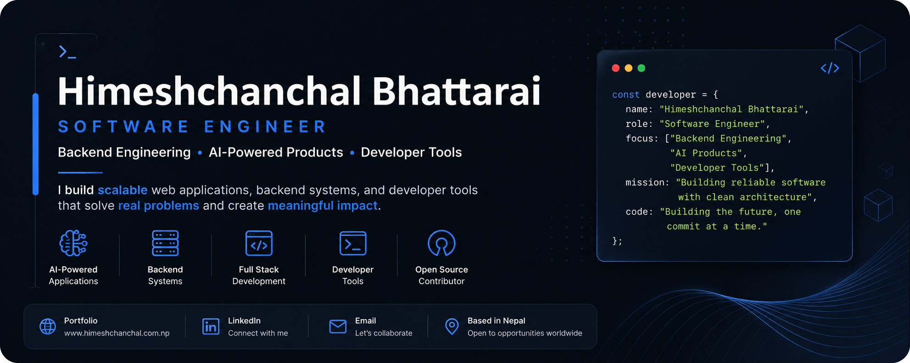

<p align="center">
  
</p>

<h1 align="center">Hi, I'm Himeshchanchal Bhattarai 👋</h1>

<p align="center">
Software Engineer • Backend Engineering • AI-Powered Products • Developer Tools
</p>

<p align="center">
Building software that is maintainable, scalable, and solves real-world problems.
</p>

---

## 👨‍💻 About Me

I'm a Full Stack Developer with a strong interest in backend engineering, AI-powered applications, and developer tools. I enjoy building backend systems, AI-powered web applications, and developer tools with an emphasis on clean architecture, maintainability, and user-focused solutions.

I enjoy taking ideas from concept to production by designing maintainable architectures, building clean APIs, and creating developer-friendly solutions.

---

## 🚀 What I Enjoy Building

- 🤖 AI-powered Web Applications
- ⚙️ Backend Systems & REST APIs
- 🛠 Developer Tools & CLI Utilities
- 📦 Open Source Projects
- 🌐 Full Stack Products

---

## ⭐ Featured Projects

### 🤖 [AI Integrated E-Commerce Platform](https://github.com/Himesh-Bhattarai/ai-powered-ecommerce)
AI-powered e-commerce platform featuring intelligent product search, conversational shopping, seller management, JWT authentication, and AI-assisted product discovery.

---

### 📄 [ContentFlow Headless CMS](https://github.com/Himesh-Bhattarai/Open_Source_CMS)
API-first content management system focused on flexible content delivery, authentication, and scalable architecture.

---

### 🌐 [Portfolio Platform](https://himeshchanchal.com.np)
A dynamic portfolio platform with an admin dashboard, blog management, analytics, SEO optimization, and project case studies.

---

### ⚡ [STATUS Commit System](https://github.com/Himesh-Bhattarai/STATUS_COMMIT)
Open-source npm package that standardizes commit messages and promotes consistent Git workflows.

---

### 📰 [NP News Portal](https://github.com/Himesh-Bhattarai/NP_NEWS_PORTAL)
Responsive news platform with category management, search functionality, and optimized content delivery.

---

---
## 🚧 Currently Working On

• AI Integrated E-Commerce Platform

• Dynamic Portfolio Platform

• Open Source Developer Tools

---

## 📦 Open Source

I enjoy building reusable tools that improve the developer experience.

Current work includes:

- STATUS Commit System (npm package)
- Developer CLI utilities
- Future open-source developer tools

---

## 🛠 Tech Stack

### Languages

JavaScript • TypeScript • Python

### Frontend

Next.js • React • Tailwind CSS

### Backend

Node.js • Express • MongoDB • REST APIs

### Tools

Git • GitHub • Postman

---

## 📊 GitHub Streak

<p align="center">


</p>

---

## 🌐 Connect With Me

- 🌍 Portfolio — https://www.himeshchanchal.com.np
- 💼 LinkedIn — https://www.linkedin.com/in/himeshchanchal-bhattarai
- 📧 Email — himesh.hcb@gmail.com

---

## 🎯 2026 Goals

- Build production-ready full-stack applications
- Deepen backend engineering knowledge
- Create high-quality developer tools
- Contribute to open source
- Continue learning software architecture and system design

---

⭐ Thanks for visiting my profile! If you're interested in backend engineering, AI-powered products, or developer tools, feel free to explore my repositories or connect with me.
```
